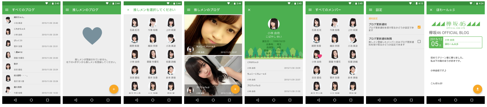

Keyakizaka46 blog reader
===


### Version 0.0.4

[Google Play](https://play.google.com/store/apps/details?id=jp.shts.android.keyakifeed&hl=ja)

### Capture




### Introduction app

下記まとめサイトに紹介いただきました。

【必須】欅坂のブログの更新を通知してくれるアプリがある模様！これは便利！！

[欅坂46まとめ坂](http://keyakizakamatome.blog.jp/archives/456304.html)

【欅坂46】欅ちゃん達のブログを閲覧出来るスマホアプリが便利すぎる件。これは捗るわ

[欅坂46まとめきんぐだむ](http://toriizaka46.jp/keyakizaka46/11848/)

### OpenSource

[android-floating-action-button](https://github.com/futuresimple/android-floating-action-button)

[picasso](https://github.com/square/picasso)

[otto](https://github.com/square/otto)

[PreferenceFragment-Compat](https://github.com/Machinarius/PreferenceFragment-Compat)

### License

```
Copyright Shota Saito

Licensed under the Apache License, Version 2.0 (the "License");
you may not use this file except in compliance with the License.
You may obtain a copy of the License at

http://www.apache.org/licenses/LICENSE-2.0

Unless required by applicable law or agreed to in writing, software
distributed under the License is distributed on an "AS IS" BASIS,
WITHOUT WARRANTIES OR CONDITIONS OF ANY KIND, either express or implied.
See the License for the specific language governing permissions and
limitations under the License.
```
